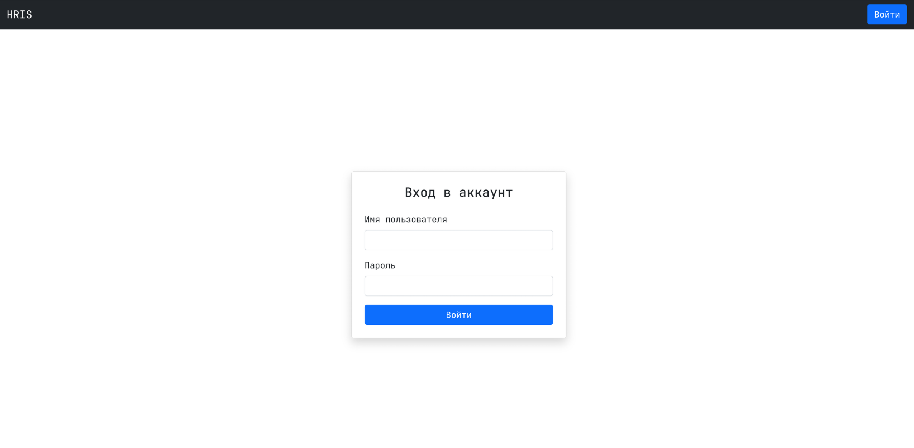
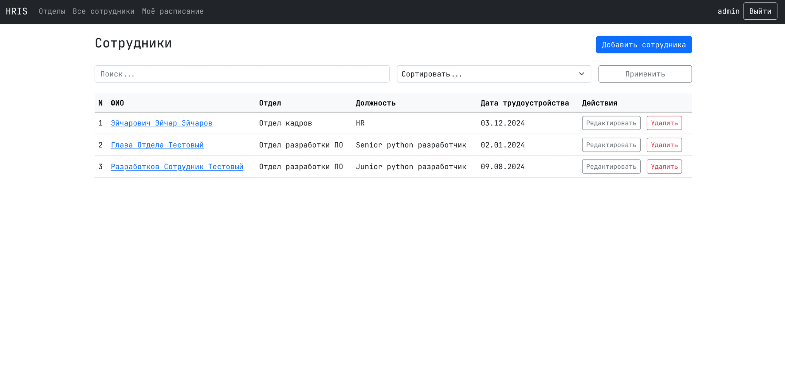
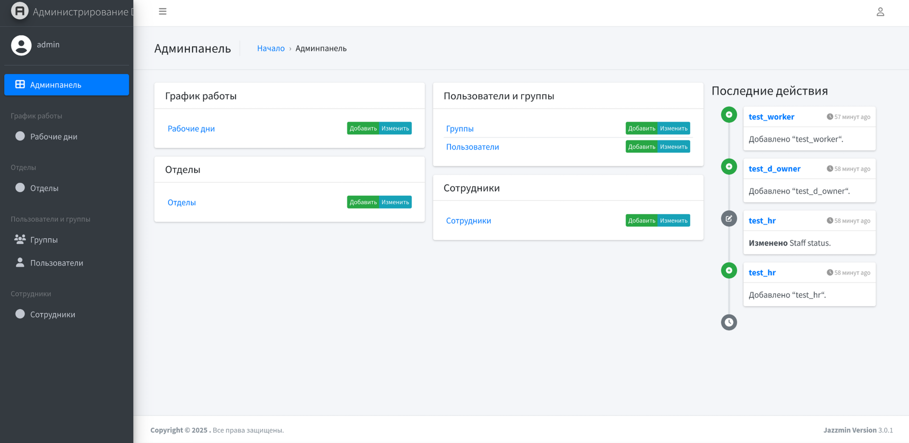

<h1 align="center">HRIS</h1>
<h3 align="center">Human Resource Information System — дипломный проект для автоматизации управления персоналом предприятия</h3>

<br>

<div align="center">
  <a href="./LICENSE"></a>
  <a href="https://www.djangoproject.com/"></a>
  <a href="https://www.python.org/"></a>
  <a href="https://htmx.org/"></a>
  <a href="https://getbootstrap.com/"></a>
</div>

<br>

<p align="center">
  
</p>

---

## Описание проекта

Веб-приложение представляет собой информационную систему по управлению персоналом (HRIS), разработанную с использованием фреймворка Django (Python). Приложение реализует роли администратора, HR, глав отделов и работников, обеспечивая разграничение доступа и выполнение соответствующих функций.

Проект предназначен для диплома по специальности 09.02.07 Информационные системы и программирование.

---
## Основные функции ролей

### Администратор:
- Управление ролями пользователей и регистрацией
- Полный доступ к учету (все CRUD операции) сотрудников, отделов и рабочих смен
- Полный доступ ко всему функционалу панели администратора

### HR:
- Полный доступ к учету (все CRUD операции) сотрудников, отделов и рабочих смен

### Глава отдела:
- Полный доступ к расписанию СВОИХ сотрудников
- Просмотр всех отделов компании
- Просмотр своего расписания

### Сотрудник:
- Просмотр своего расписания
- Просмотр всех отделов компании

### Реализация ролей:
- Администратор создается с помощью manage.py createsuperuser
- HR это пользователь, у которого указан статус персонала (is_staff), указывается в админка/Пользователи/Права доступа/Статус персонала
- Главой отдела становится сотрудник, который был указан как глава отдела при создании/редактировании отдела
- Сотрудник это пользователь, который указана в записи "Сотрудник" в поле "учетная запись сотрудника"
- На сайте можно только авторизоваться, создают аккаунты admin или HR(если ему это указано в правах в админке)

---
## Технологии

- Python 3.x
- Django 4.x
- Postgres-17 (но есть возможность изменить)
- Bootstrap5
- HTMX

---
## Установка

1. Клонируйте репозиторий:

```bash
git clone https://github.com/TvoiConfig/HRIS.git
cd hris
```

2. Установите зависимости:

```bash
pip install -r requirements.txt
```

3. В директории с manage.py создайте .env и для подключения к postgres определите там следующие переменные:
```
DB_NAME=название БД 
DB_USER=пользователь
DB_PASSWORD=пароль
DB_HOST=localhost (или если БД удаленная укажите адрес)
DB_PORT=5432 (стандартный порт postgres)
```

3. Выполните миграции и создайте суперпользователя:

```bash
python manage.py migrate
python manage.py createsuperuser
```

4. Запустите сервер:

```bash
python manage.py runserver
```

5. Перейдите по адресу [http://127.0.0.1:8000](http://127.0.0.1:8000)

6. Войдите в админку [http://127.0.0.1:8000/admin](http://127.0.0.1:8000/admin) и создайте учетные записи для работников

---
## Структура проекта

- `core/` - шаблон index, утилиты, миксины, декораторы
- `departments/` - отделы, их бизнес логика и UI
- `employees/` - сотрудники, их бизнес логика и UI
- `hris/` - системное приложение с settings.py
- `schedule/` - рабочие дни, их бизнес логика и UI
- `static/` - папка со статическими скриптами и стилями
- `templates` - общие для всех шаблонов navbar и заголовки
- `users/` - управление пользователями, аутентификация

---
## Дополнительные скриншоты проекта

### Страница авторизации


### Страница сотрудников


### Страница админ-панели

